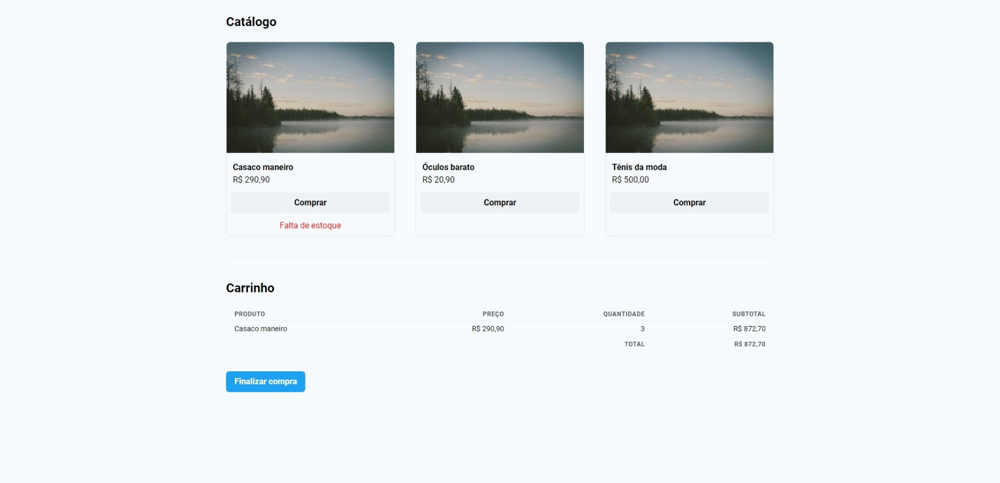

<h1 align="center">
     Carrinho de Comprar com Redux
</h1>

## 💻 Sobre o projeto

Projeto de um carrinho de compras utilizando Redux.

---

## ⚙️ Funcionalidades

- [x] Adicionar um novo produto ao carrinho;
- [x] Cálculo dos preços sub-total e total do carrinho;
- [x] Validação de estoque;
- [x] Exibição de mensagens de erro.

---

## 🎨 Layout

<p align="center" style="display: flex; align-items: flex-start; justify-content: center;">
  
</p>

---

## 🚀 Como executar o projeto

### Pré-requisitos

Antes de começar, você vai precisar ter instalado em sua máquina as seguintes ferramentas:
[Git](https://git-scm.com), [Node.js](https://nodejs.org/en/). 
Além disto é bom ter um editor para trabalhar com o código como [VSCode](https://code.visualstudio.com/)

#### 🧭 Rodando a aplicação web (Frontend)

```bash
# Clone este repositório
$ git clone git@github.com:PedroZago/ShopCart-ReactRedux.git
# Acesse a pasta do projeto no seu terminal/cmd
$ cd ShopCart-ReactRedux
# Instale as dependências
$ yarn install
# Execute a API com os dados da aplicação
$ yarn server
# Execute a aplicação
$ yarn start
# A aplicação será aberta na porta:3000 - acesse http://localhost:3000
```

---

## 🛠 Tecnologias

As seguintes ferramentas foram usadas na construção do projeto:

#### **Website**  ([React](https://reactjs.org/)  +  [TypeScript](https://www.typescriptlang.org/))

-   **[Chakra Ui](https://github.com/chakra-ui/chakra-ui)**

---

## 📝 Licença

Este projeto esta sobe a licença [MIT](./LICENSE).
